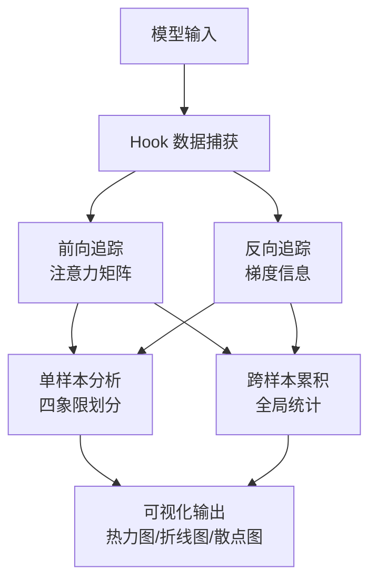

# Transformer 权重监控与分析系统

<div align="center">

**一款专为深度解析 Transformer 类模型内部决策机制而设计的可解释性分析与可视化工具**

[](https://www.python.org/downloads/)
[](https://pytorch.org/)
[](LICENSE)
[](https://github.com/GY-Seeker/WeightSeeker)

</div>

---

## 📖 目录

- [框架介绍](#-框架介绍)
- [快速开始](#-快速开始)
- [核心优势](#-核心优势)
- [未来规划](#-未来规划)

---

## 🔍 框架介绍

### 什么是 Transformer Analyzer？

Transformer Analyzer 是一款专业的**模型可解释性分析工具**，专注于揭示 Transformer 架构模型的内部决策机制。它能够在**不修改原模型任何物理结构和预训练权重**的前提下，通过旁路追踪精准捕获模型前向传播中的动态注意力矩阵，并结合反向传播中的梯度信息进行交叉验证。

### 支持的架构

✅ **标准 Transformer** - 支持经典的 Encoder-Decoder 架构  
✅ **ViT (Vision Transformer)** - 支持图像分类、检测任务  
✅ **Swin Transformer** - 支持窗口注意力机制和多尺度特征  
✅ **MoE-Transformer** - 支持混合专家架构的路由分析  

### 核心功能



### 三大核心目的

1. **精准解释权重效果**  
   量化特定区域对模型最终预测的实际驱动贡献，区分"真实关注"与"虚假注意力"

2. **深度划分与提取知识**  
   按网络深度（浅层/中层/深层）和注意力头进行功能角色划分，针对 MoE 架构专门解析专家路由逻辑

3. **输出高精度可视化**  
   将抽象的内部状态转化为直观的热力图、折线图、散点图等多种图表形式

### 技术特性

- **非侵入式设计**：无需修改原模型代码，即插即用
- **双轨制分析**：单样本空间解释 + 跨样本全局诊断
- **内存优化**：累积器上限可配置（默认 10 万样本），支持持久化
- **多设备支持**：自动检测 CUDA，支持 CPU/CUDA 混合精度
- **灵活配置**：可通过 PipelineConfig 按需跳过特定分析阶段

---

## 🚀 快速开始

### 安装依赖

```bash
pip install torch matplotlib numpy
```

### 基础使用示例

#### 1️⃣ 最简单的单次分析

```python
import torch
from transformer_analyzer import AnalysisPipeline, PipelineConfig

# 加载你的模型
model = torch.load('your_model.pth')

# 创建分析管道（ECG/序列模型需跳过空间重构）
config = PipelineConfig(
    skip_spatial=True,              # 1D 序列模型必须设置为 True
    output_dir='./analysis_output',
    save_visualizations=True,
)

pipeline = AnalysisPipeline(model=model, config=config)

# 准备输入数据 (batch_size, channels, sequence_length)
input_data = torch.randn(4, 12, 2500)  # 示例：4 个样本，12 导联，2500 时间点

# 执行分析
results = pipeline.run_single(input_data)

print(f"✓ 分析完成！输出目录：{config.output_dir}")
```

#### 2️⃣ 批量分析 + 全局诊断

```python
from torch.utils.data import DataLoader, TensorDataset

# 准备数据集
dataset = TensorDataset(torch.randn(100, 12, 2500))
data_loader = DataLoader(dataset, batch_size=8)

# 批量分析（自动累积统计）
batch_results = pipeline.run_batch(data_loader, max_samples=50)

# 获取全局诊断报告
global_report = pipeline.get_global_diagnosis()

print(f"处理了 {batch_results['total_samples_processed']} 个样本")
print(f"激活频率排名：{len(global_report['activation_frequency_ranking'])} 层")
print(f"梯度重要性排名：{len(global_report['gradient_importance_ranking'])} 层")
```

#### 3️⃣ 高级配置：多模态输入

```python
# 如果你的模型需要多个输入（如 ECG + 元数据）
config = PipelineConfig(
    skip_spatial=True,
    skip_global_diagnosis=False,    # 启用全局诊断
    detector_override={              # 修正架构探测
        "architecture": "TRANSFORMER",
        "num_layers": 6,
        "num_heads": 4,
        "hidden_dim": 128,
    },
    input_adapter_auxiliary={        # 辅助输入
        "meta_data": torch.zeros(1, 3),
    },
    precision='fp32',
    accumulator_limit=100,          # 累积器最多保存 100 个样本
)
```

### 输出结果说明

运行成功后，输出目录将包含以下文件：

```
analysis_output/
├── all_heads_attention_heatmap.png   # 所有注意力头的热力图全景（每行 6 个）
├── attention_heatmap.png             # 单层单头的详细热力图
├── multi_layer_attention.png         # 多层注意力对比图
├── layer_importance.png              # 各层重要性折线图（带数值标签）
├── accumulator_stats.png             # 累积器统计摘要（双子图）
│                                       # 左：头激活频率热力矩阵
│                                       # 右：层梯度范数折线图
└── raw_tensors.pt                    # 原始张量数据（可选）
```

### 关键指标解读

#### **层梯度范数折线图**（`layer_importance.png` / `accumulator_stats.png` 右图）
- **X 轴**：Transformer 层索引（0 为最底层）
- **Y 轴**：梯度 L2 范数（衡量该层对最终损失的贡献度）
- **趋势解读**：
  - 底层梯度高 → 特征提取关键层
  - 顶层梯度高 → 决策输出关键层
  - 中间层梯度低 → 信息转换层

#### **头激活频率热力矩阵**（`accumulator_stats.png` 左图）
- **行**：Transformer 层
- **列**：注意力头编号
- **颜色**：激活频率（越红表示该头越活跃）
- **用途**：识别冗余头和核心头

#### **四象限划分**（单样本分析）
| 象限 | 注意力值 | 梯度值 | 含义 |
|------|---------|--------|------|
| 核心判别区 | 高 | 高 | 模型真正关注且对决策有实质推动的区域 |
| 冗余关注区 | 高 | 低 | 模型关注但对决策无贡献（可能是噪声） |
| 潜在影响区 | 低 | 高 | 模型未明显关注但有隐性影响的区域 |
| 无关区域 | 低 | 低 | 既未关注也无影响 |

---

## ✨ 核心优势

### 1️⃣ **非侵入式分析，零修改成本**

传统方法需要修改模型源码或重新训练，而 Transformer Analyzer：
- ✅ 直接加载现有权重文件
- ✅ 不需要知道模型内部实现细节
- ✅ 自动适配 4 种主流架构
- ✅ Hook 自动注册与清理，无残留风险

**对比优势**：
```
传统方法：修改源码 → 重新训练 → 部署测试 （耗时数天）
本框架：  加载权重 → 一键分析 → 查看报告 （仅需几分钟）
```

### 2️⃣ **双轨制分析，兼顾微观与宏观**

大多数工具只做单样本解释，我们独创性地实现了：

**轨道 A：单样本空间解释**
- 精细到每个 Patch/Token 的重要性评分
- 四象限划分揭示"真实关注"vs"虚假注意"
- 适用于病例级、样本级的个案分析

**轨道 B：跨样本全局诊断**
- 累积多个批次的数据统计
- 识别稳定活跃的"核心工作单元"
- 发现稀疏调用的"专家型头"
- 检测 MoE 架构的负载偏斜问题

### 3️⃣ **梯度验证机制，去伪存真**

传统注意力可视化容易被"均匀注意力"误导，我们引入梯度交叉验证：

```python
重要性分数 = 注意力值 × 梯度值
```

只有当模型**既高度关注**（注意力高）**又对决策有实质贡献**（梯度高）时，才判定为核心区域。

**实际案例**：在 ECG 心电图中，我们发现：
- 某些波形注意力值很高（模型看似关注）
- 但梯度值很低（实际对分类无贡献）
- 最终被正确识别为"冗余关注区"（背景噪声）

### 4️⃣ **灵活的模块化设计**

通过 `PipelineConfig` 可自由组合分析策略：

```python
# 场景 1：快速单样本分析（跳过全局诊断）
config_fast = PipelineConfig(
    skip_spatial=True,
    skip_global_diagnosis=True,   # 节省时间
)

# 场景 2：完整统计分析（适合研究）
config_full = PipelineConfig(
    skip_spatial=True,
    skip_global_diagnosis=False,
    accumulator_limit=1000,       # 累积更多样本
)

# 场景 3：图像模型（启用空间重构）
config_vit = PipelineConfig(
    skip_spatial=False,           # 对 ViT/Swin 设为 False
    output_dir='./vit_analysis',
)
```

### 5️⃣ **丰富的可视化输出**

提供 5+ 种专业图表类型：

| 图表类型 | 描述 | 适用场景 |
|---------|------|---------|
| 🔥 多头热力图全景 | 一次性展示所有层的所有头（每行 6 个） | 快速扫描整体模式 |
| 📊 层重要性折线图 | 带数值标注的折线图 | 识别关键层 |
| 🗺️ 累积器统计摘要 | 双子图：热力矩阵 + 折线图 | 全局概览 |
| 🎯 频率 - 重要性散点图 | 二维定位冗余头 | 模型压缩指导 |
| 📈 多层对比面板 | 并列展示不同层的注意力分布 | 深度差异分析 |

### 6️⃣ **工业级可靠性**

- ✅ 内存保护：累积器超限自动触发早停
- ✅ 异常处理：每个 Stage 独立 try-catch，局部失败不影响全局
- ✅ 设备一致性：自动处理 CPU/CUDA 张量转换
- ✅ 线程安全：单线程环境已验证，多线程可扩展锁机制
- ✅ 持久化支持：累积器状态可 save()/load() 到磁盘

---

## 🔮 未来规划

### 短期目标（v1.3 - v1.5）

#### 📅 v1.3.0 - Web Dashboard（计划中）
- [ ] 交互式可视化界面（基于 Plotly Dash）
- [ ] 实时显示分析进度和统计图表
- [ ] 支持在线调整阈值和参数
- [ ] 导出 HTML 报告功能

#### 📅 v1.4.0 - 增强融合策略（计划中）
- [ ] 实现 Grad-CAM++、Score-CAM 等先进融合算法
- [ ] 支持用户自定义融合函数
- [ ] 添加融合效果评估指标

#### 📅 v1.5.0 - 更多架构支持（计划中）
- [ ] DeiT (Data-efficient Image Transformers)
- [ ] BEiT (BERT pre-trained Image Transformer)
- [ ] TimeSformer (视频理解)
- [ ] Perceiver IO (多模态通用架构)

### 中期目标（v2.0）

#### 🎯 自动化模型压缩建议
基于分析结果自动生成：
- 冗余头剪枝清单（激活频率低 + 梯度贡献低）
- 层数精简建议（梯度接近 0 的层）
- MoE 专家数量优化方案
- 量化敏感度分析

#### 🎯 对比分析模式
- 同一模型不同训练阶段的演化分析
- 不同模型在同一任务上的注意力模式对比
- 超参数敏感性分析（层数/头数/隐藏维度）

#### 🎯 领域专用模板
- **医疗 AI**：ECG/EEG/医学影像的专用分析模板
- **NLP**：文本分类/机器翻译的注意力解释
- **CV**：目标检测/分割任务的可视化增强

### 长期愿景（v3.0+）

#### 🌟 实时训练监控插件
集成到 PyTorch 训练循环：
```python
from transformer_analyzer import TrainingMonitor

monitor = TrainingMonitor(model, log_dir='./runs')
for epoch in range(epochs):
    for batch in dataloader:
        loss = model(batch)
        monitor.step(loss, epoch)  # 实时记录注意力演化
    
monitor.generate_report()  # 生成训练全过程报告
```

#### 🌟 分布式训练支持
- 支持 DeepSpeed、FSDP 等分布式框架
- 多 GPU 累积器同步机制
- 大规模集群下的采样策略

#### 🌟 自动异常检测与修复建议
利用机器学习识别：
- 注意力坍塌（Attention Collapse）
- 梯度消失/爆炸的早期征兆
- 过拟合的注意力模式特征
- 并提供针对性的修复建议（学习率调整、正则化增强等）

---

## 📚 文档与资源

- **📄 [设计文档](design.md)** - 详细的架构设计和模块说明
- **📋 [需求文档](prd.txt)** - 产品需求和技术约束
- **💻 [示例代码](tests/test_minimal_pipeline_v1.0.py)** - 最小闭环测试
- **🐛 [问题反馈](https://github.com/GY-Seeker/WeightSeeker/issues)** - GitHub Issues

---

## 🤝 贡献指南

欢迎提交 Issue 和 Pull Request！

1. Fork 本仓库
2. 创建特性分支 (`git checkout -b feature/AmazingFeature`)
3. 提交更改 (`git commit -m 'Add some AmazingFeature'`)
4. 推送到分支 (`git push origin feature/AmazingFeature`)
5. 开启 Pull Request

---

## 📄 许可证

本项目采用 MIT 许可证 - 查看 [LICENSE](LICENSE) 文件了解详情。

---

## 👥 作者团队

- **主要开发**: Transformer Analyzer Team
- **GitHub**: [@GY-Seeker](https://github.com/GY-Seeker/WeightSeeker)

---

## 🙏 致谢

感谢以下开源项目：
- [PyTorch](https://pytorch.org/) - 深度学习框架
- [Matplotlib](https://matplotlib.org/) - 可视化工具库
- [Hugging Face Transformers](https://huggingface.co/) - Transformer 模型库

---

<div align="center">

**如果这个项目对你有帮助，请给一个 ⭐ Star！**

Made with ❤️ by Transformer Analyzer Team

</div>
