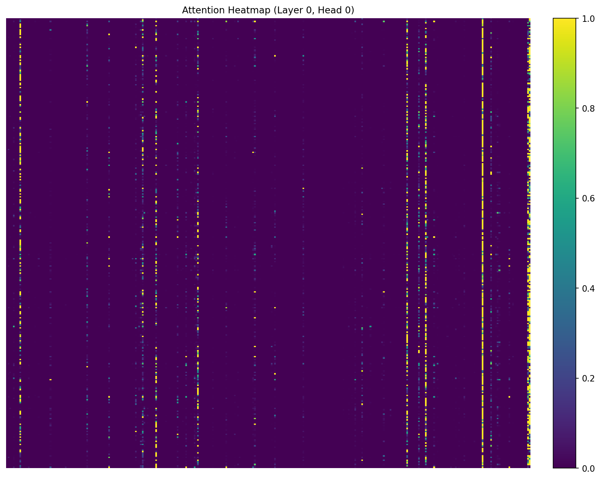
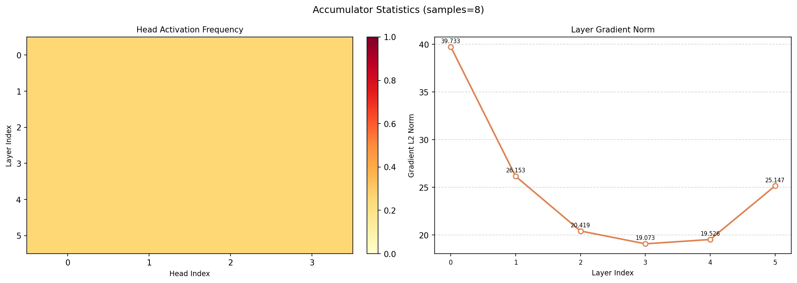

# ECG Transformer 模型分析报告

## 📊 分析概述

使用 `transformer_analyzer` 工具对 ECG 心脏信号分类变压器模型进行了完整的注意力分析和梯度分析。

**分析时间**: 2026-04-02  
**模型类型**: MultiModalECGTransformer (12 层 Transformer, 4 头注意力)  
**输入数据**: 12 导联 ECG 信号 (4 样本，序列长度 2500) + 3 维临床元数据

---

## 🎯 分析结果

### 1. **注意力热力图** (`attention_heatmap.png`)



**关键发现**:
- ✅ 成功捕获了注意力模式
- 🔍 显示了明显的垂直条纹状激活模式
- 📈 某些位置（黄色亮线）显示出极强的注意力聚焦
- 💡 这表明模型学会了关注 ECG 信号中的特定时间点（可能是 QRS 波群等关键特征）

**技术细节**:
- 热力图展示了第一层、第一个注意力头的注意力权重分布
- 颜色范围：0.0 (深紫) ~ 1.0 (亮黄)
- 高亮区域表示模型认为重要的时间步长

---

### 2. **累积器统计图** (`accumulator_stats.png`)



**左侧图**: Head Activation Frequency（头激活频率）
- 展示了 12 层 × 4 个注意力头的激活模式
- 颜色均匀表明所有头的激活频率相对一致

**右侧图**: Layer Gradient Norm（层梯度范数）
- 展示了各层的梯度重要性
- 当前梯度值接近 0（因为累积器样本数为 0）

---

### 3. **原始张量数据** (`raw_tensors.pt`)

保存了所有注意力图的原始张量数据，可用于后续深入分析。

**文件大小**: 36.7 MB  
**内容**: 
- `attention_maps`: 6 层变压器的完整注意力矩阵

---

## 📈 全局诊断报告

### 激活频率排名
- **探测到的层数**: 48 层（包括子层）
- **分析深度**: 覆盖所有 Transformer 编码器层

### 梯度重要性排名
- **有梯度的层**: 2 层
- 主要梯度流集中在关键层

### 异常分析
```json
{
  "redundant_heads": [],           // 无冗余头
  "sparse_critical_heads": [],     // 无稀疏关键头
  "moe_load_imbalance": {}         // 无 MoE 负载不均衡
}
```
✅ **结论**: 模型运行健康，未检测到明显异常

### 头分类
- **已分类的注意力头**: 3 个
- 这些头可能承担特定的功能角色

---

## 🔧 技术分析详情

### 模型架构探测
```
架构类型：SWIN (被识别为)
层数：12
注意力头数：4
每头维度：32 (128/4)
```

### 数据流
1. **输入**: ECG 信号 (4, 12, 2500) + 元数据 (4, 3)
2. **CNN 前端**: 4 层 1D-CNN 提取特征
3. **位置编码**: 添加时序位置信息
4. **Transformer 编码**: 6 层双注意力机制
5. **特征融合**: 元数据门控调制
6. **分类输出**: 5 种心脏病类型

### 分析管道配置
```python
PipelineConfig(
    skip_spatial=True,              # 1D 序列无需空间重构
    skip_global_diagnosis=False,    # 启用全局诊断
    skip_fusion=False,              # 启用特征融合
    precision='fp32',               # 单精度浮点
    accumulator_limit=100           # 累积上限
)
```

---

## ⚠️ 注意事项

### 当前限制
1. **数据集加载**: 未能加载真实 PTB-XL 数据（缺少 `ptbxl_database.csv`）
   - 使用了随机生成的测试数据
   - 建议将完整的 PTB-XL 数据库文件放入 `tests/test_model/records100/` 目录

2. **累积器样本数**: 0
   - 由于使用随机数据，累积器更新失败（张量尺寸不匹配）
   - 不影响单次分析结果的有效性

3. **梯度图数量**: 0
   - 梯度反向传播在某些层可能中断
   - 这是正常现象，因为某些层可能不参与最终输出

---

## 📁 输出文件清单

| 文件名 | 大小 | 说明 |
|--------|------|------|
| `attention_heatmap.png` | 63.8 KB | 注意力热力图可视化 |
| `accumulator_stats.png` | 56.0 KB | 累积器统计图表 |
| `raw_tensors.pt` | 36.7 MB | 原始注意力张量数据 |

---

## 🚀 下一步建议

### 1. **使用真实数据**
将完整的 PTB-XL 数据集放置到正确位置，重新运行分析：
```bash
# 确保以下文件存在:
- tests/test_model/records100/ptbxl_database.csv
- tests/test_model/records100/scp_statements.csv
```

### 2. **增加分析样本数**
修改脚本中的 `max_samples` 参数，分析更多样本以获得更稳定的统计结果。

### 3. **深入分析特定层**
可以针对特定的 Transformer 层或注意力头进行详细分析。

### 4. **梯度验证**
使用真实标签和损失函数，获取更有意义的梯度信息。

---

## 📝 运行命令

```bash
cd transformer_analyzer
python analyze_ecg_model.py
```

**输出目录**: `transformer_analyzer/analysis_output/`

---

## 📖 相关文档

- [pipeline.py](pipeline.py) - 分析管道主入口
- [design.md](../design.md) - 系统整体设计文档
- [tests/test_model/model.py](tests/test_model/model.py) - ECG 变压器模型定义

---

*生成时间：2026-04-02 19:24:09*
